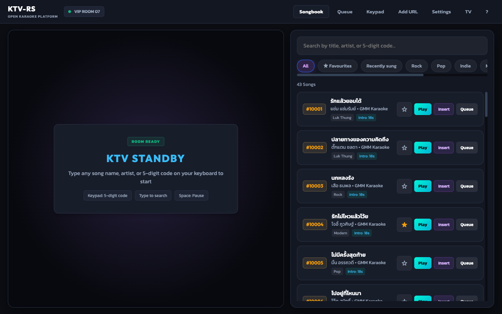
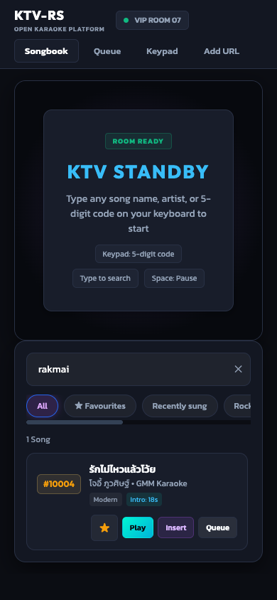
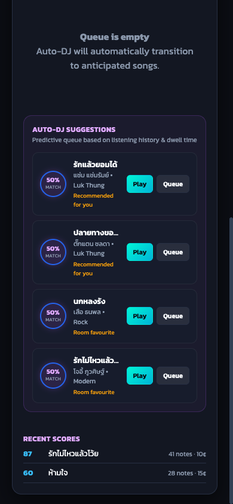

# KTV-RS: Modern Open-Source Karaoke Platform 🎤

> A high-performance, minimalist Web Karaoke player built 100% in **Rust** using **Dioxus 0.7.1 (Web / WASM)**. Designed for real-world party rooms and home setups with official Thai music feeds (`@gmmkaraoke`, `@whattheduckmusic`), automated intro bumper bypass, verified song catalog, dual-stream vocal toggles, and an intelligent Auto-DJ recommendation engine.

[](https://github.com/ozoneRatchapon/ktv-rs/actions/workflows/ci.yml)
[](https://github.com/ozoneRatchapon/ktv-rs/actions/workflows/prod-check.yml)
[](https://dioxuslabs.com/)
[](LICENSE)
[](#privacy--legal-compliance)

---

## Screenshots

| Desktop | Thai search (romanised) | Recent scores |
| :---: | :---: | :---: |
|  |  |  |

Live: https://ktv-rs.solana-thailand.workers.dev · Changes: [CHANGELOG.md](CHANGELOG.md)

## Key Features

### 1. Direct Official Karaoke Streams
* Indexed official karaoke catalogs from **GMM Grammy** and **What The Duck**.
* Includes full verified collections for top artists like **COCKTAIL** (*คุกเข่า*, *เธอ*, *คู่ชีวิต*, *ดึงดัน*, *เธอทำให้ฉันเสียใจ*), **BOWKYLION** (*ที่คั่นหนังสือ*, *วาดไว้*), **Silly Fools** (*วัดใจ*), **Big Ass** (*เล่นของสูง*), etc.

### 2. Unobstructed YouTube Players
* Nothing is drawn over either YouTube player (YouTube Required Minimum Functionality: no overlays in front of an embedded player); banners and badges live below the video.
* Pause/play from the YouTube player's own controls is mirrored into the app, so the guide and the timer stay in step.
* Clicking inside a video still leaves Type-to-Search working: the app takes keyboard focus back from the player right after the click.

### 3. KTV Timeline Scrubber & Quick Jumps
* Custom HTML5 timeline scrubber slider showing formatted `current_time` and `total_time` (`mm:ss`).
* Dedicated on-screen **`-10s`** and **`+10s`** jump buttons for repeating tricky vocal passages or skipping guitar solos.
* Keyboard arrow navigation: **`ArrowLeft`** (-5s) and **`ArrowRight`** (+5s).

### 4. Synchronized Vocal Switcher with Intro Offset Compensation
* **Karaoke Mode**: Official backing track with lyrics.
* **Original Vocal Mode**: Instant switch to the official artist MV, shown beside (or, on narrow screens, below) the karaoke video, to hear the singer while preserving song progress. The MV plays only while visible; it is never used as a hidden audio source.
* **Offset Compensation**: Each song's `guide` maps karaoke time to MV time (`MV = offset_secs + rate × karaoke`), so the switch lands on the same lyric without restarting from 0.
* **Guide Timing Tools** (Settings → Guide Timing Tools): line up an original-vocal MV by ear with the embedded players only (no audio download). Nudge ±1 s / ±0.1 s while *Hear both* plays the karaoke music under the guide (misalignment is heard as an echo); for an MV that drifts, *Mark in sync* early and late and *Fit speed*. *Save* keeps the timing on this device; *Copy JSON* gives the `guide` entry for `assets/catalog.json`.

### 5. OG KTV "Type-to-Search" (Global Keystroke Capture)
* Type any song title, artist, or 5-digit code anywhere on your keyboard to instantly filter the catalog.
* Native support for `Backspace`, `Delete`, and `Escape` for both English and Thai scripts.
* ☆ a song to keep it under **★ Favourites**; songs you sing for 30 seconds or more appear under **Recently sung** (both stay on this device).
* Thai-friendly matching: tone marks and spaces are optional (`รักไมไหว` finds `รักไม่ไหว`), romanised titles work (`rak mai wai`), and a query typed with the keyboard on the wrong layout (`l;ylfu` for `สวัสดี`) is retried on the other one. Aliases come from the official karaoke video titles: `python3 tools/title_aliases.py --write`.

### 6. 10-Key KTV Keypad Remote & On-Screen Play/Pause
* 5-digit quick code dialer (e.g. `#10026` for *คุกเข่า*).
* Real-time Key Transposition (`-6` to `+6` semitones) and tempo control (`0.9x` to `1.1x`).
* Dedicated **Play / Pause** toggle button with active state styling.

### 7. Auto-DJ Recommendation Engine
* **Dwell Telemetry**: Records active singing duration per track.
* **Early-skip pruning**: A song skipped early (under 30 seconds or 20% of its length) rules its artist and genre out of Auto-DJ picks for the session.
* **Auto Fallback**: Automatically continues music playback with the top anticipated recommendation when the queue finishes.

### 8. Install as an App
* Chrome/Edge: **Install**; iPhone/iPad Safari: **Share → Add to Home Screen**. KTV-RS then opens in its own window, which suits a booth PC or TV.

### 9. Mic Pitch Meter & Tuning Score
* **Mic: On** shows the note you are singing (e.g. `A4 +12¢`), detected in Rust/wasm (McLeod pitch method) from an AudioWorklet. Mic audio never leaves the device. For its first second it measures the room, then ignores anything not clearly louder than the room.
* **Tuning 0–100** rates how exactly your held notes land on a semitone (after 3 held notes). It does not know the song's melody, so it cannot tell whether they are the right notes; tap the badge for the full explanation.
* When a song ends, a result card shows that take's score; **Queue → Recent scores** keeps the last 20 on this device.

---

## Keyboard Controls

| Key | Action |
| :--- | :--- |
| **Any Character / Number** | Type-to-Search across the catalog |
| **`Backspace` / `Delete`** | Delete character from search query |
| **`Escape`** | Clear search query |
| **`Space`** | Toggle Play / Pause |
| **`ArrowLeft`** | Jump backward 5 seconds |
| **`ArrowRight`** | Jump forward 5 seconds |
| **`?`** | Show / hide the shortcut list (also the **?** button in the header; open on a first visit) |

A button reached with `Tab` keeps `Space`/`Enter`; after a mouse click `Space` is always pause.

---

## Getting Started

### Prerequisites
* Rust 1.80+ (`wasm32-unknown-unknown` target)
* Dioxus CLI 0.7.10 (the version CI uses):
  ```bash
  cargo install dioxus-cli --version 0.7.10
  ```

### Run Locally
```bash
dx serve --platform web --port 8080
```
Open [http://localhost:8080](http://localhost:8080) in your browser.

### Run Tests
```bash
cargo test                                                    # Rust unit/integration tests (tests/*.rs)
node --test tests/ktv_sync.test.cjs tests/ktv_keys.test.cjs   # player sync core + keyboard (JS)
# End-to-end in headless Chrome, against the release bundle:
tools/build_web.sh && npx wrangler@4.141.0 dev --port 8788    # in another terminal
node --test tests/e2e/app.test.mjs                            # KTV_URL=<url> to test another deployment
```

### Adding songs
See [docs/ADDING_SONGS.md](docs/ADDING_SONGS.md). Requests and guide timings come in through the repo's **Song request** and **Guide timing** issue forms (the app's **Share on GitHub** button in Guide Timing Tools fills the latter in).

### Run Linting
```bash
cargo clippy --fix --allow-dirty --quiet
```

---

## Privacy & Legal Compliance

* **100% Client-Side WebAssembly**: No media or copyrighted files are stored on our servers.
* **YouTube Embed Compliance**: Standard YouTube embedded players only, following the [YouTube API Developer Policies](https://developers.google.com/youtube/terms/developer-policies) and [Required Minimum Functionality](https://developers.google.com/youtube/terms/required-minimum-functionality): no overlays, no hidden or background playback, no audio separation, no downloading; players stay at least 200x200. All ad views, watch time, and royalties go directly to the respective record labels and artists.
* **Privacy note**: [`/privacy.html`](public/privacy.html) lists everything stored on the device; **Settings → Clear my data on this device** removes it.
* **Zero Tracking**: No tracking cookies, analytics pixels, or personal data collection (GDPR & PDPA compliant). Fonts (Kanit, Outfit; SIL OFL 1.1) are self-hosted from `public/fonts`, so the app itself makes no third-party requests; only the YouTube player frames (youtube-nocookie.com) and thumbnails (i.ytimg.com) load from Google.

---

## Documentation Links

* [Architecture & Math Guide](file:///Users/ozone/karaoke/docs/ARCHITECTURE.md)
* [Cloudflare Workers & Pages Deployment Guide](file:///Users/ozone/karaoke/docs/CLOUDFLARE_WORKERS_GUIDE.md)
* [Developer Handover & Solana Integration Blueprint](file:///Users/ozone/karaoke/docs/DEVELOPER_GUIDE.md)
* [System Handover 001](file:///Users/ozone/karaoke/.handovers/001_ktv_complete_system_handover.md)
* [Issue 001: Video Focus Trap & Vocal Offset Fix](file:///Users/ozone/karaoke/.issues/001_vocal_switch_offset_and_scrubber_controls.md)

---

## License

MIT License.
