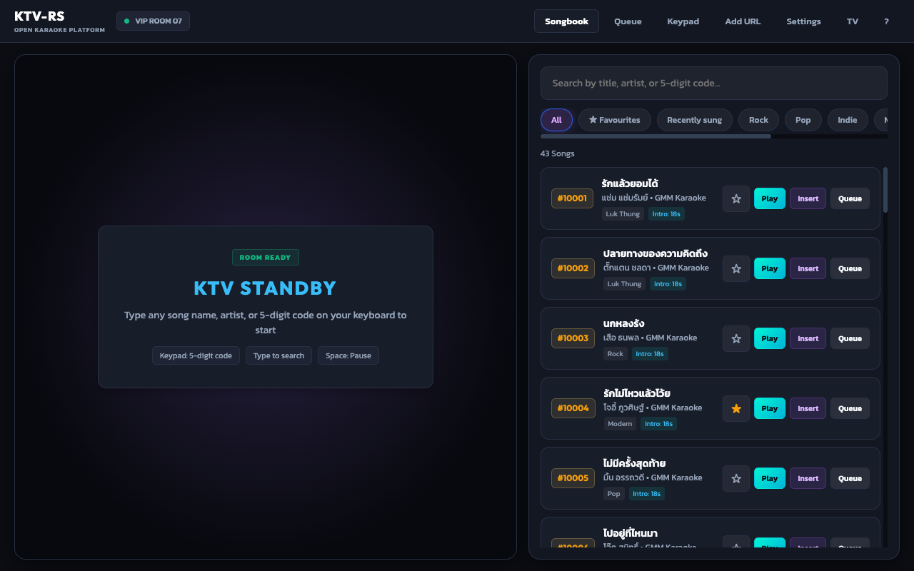
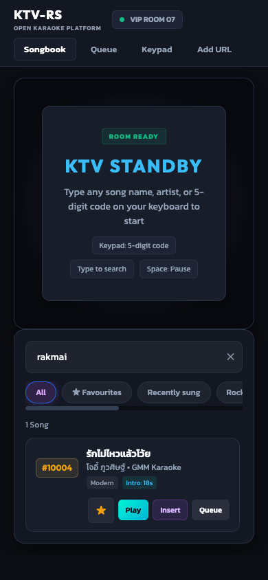
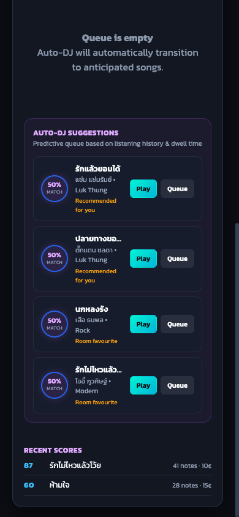

# KTV-RS: Modern Open-Source Karaoke Platform 🎤

> A high-performance, minimalist Web Karaoke player built 100% in **Rust** using **Dioxus 0.7.1 (Web / WASM)**. Designed for real-world party rooms and home setups with official Thai music feeds (`@gmmkaraoke`, `@whattheduckmusic`, `@MuzikMoveKaraoke`, RS Music, Smallroom), automated intro bumper bypass, verified song catalog, dual-stream vocal toggles, and an intelligent Auto-DJ recommendation engine.

[](https://github.com/ozoneRatchapon/ktv-rs/actions/workflows/ci.yml)
[](https://github.com/ozoneRatchapon/ktv-rs/actions/workflows/prod-check.yml)
[](https://dioxuslabs.com/)
[](LICENSE)
[](#privacy--legal-compliance)

---

## Screenshots

| Desktop | Thai search (romanised) | Recent scores |
| :---: | :---: | :---: |
|  |  |  |

Live: https://ktv-rs.solana-thailand.workers.dev · Changes: [CHANGELOG.md](CHANGELOG.md)

## Key Features

### 1. Direct Official Karaoke Streams
* Full official karaoke libraries of **GMM Grammy** (GMM Karaoke), **What The Duck**, **Muzik Move**, **RS** and **Smallroom**: ~8,500 songs, loaded after the first paint, plus a curated set with genres. Original-vocal guides (the **Vocal** switch) are timed for the curated songs and ~2,800 library songs.
* Includes full verified collections for top artists like **COCKTAIL** (*คุกเข่า*, *เธอ*, *คู่ชีวิต*, *ดึงดัน*, *เธอทำให้ฉันเสียใจ*), **BOWKYLION** (*ที่คั่นหนังสือ*, *วาดไว้*), **Silly Fools** (*วัดใจ*), **Big Ass** (*เล่นของสูง*), etc.

### 2. Unobstructed YouTube Players
* Nothing is drawn over either YouTube player (YouTube Required Minimum Functionality: no overlays in front of an embedded player); banners and badges live below the video.
* Pause/play from the YouTube player's own controls is mirrored into the app, so the guide and the timer stay in step.
* Clicking inside a video still leaves Type-to-Search working: the app takes keyboard focus back from the player right after the click.

### 3. KTV Timeline Scrubber & Quick Jumps
* Custom HTML5 timeline scrubber slider showing formatted `current_time` and `total_time` (`mm:ss`).
* Dedicated on-screen **`-10s`** and **`+10s`** jump buttons for repeating tricky vocal passages or skipping guitar solos.
* Keyboard arrow navigation: **`ArrowLeft`** (-5s) and **`ArrowRight`** (+5s).
* **Practice loop** for musicians and singers: **A** at the start of a part, **B** at its end, and it plays A→B over and over (✕ or a new song ends it).
* **Chords ↗** opens a web search for the song's chords. KTV-RS ships no chord sheets: they are the chord sites' own work, and the audio cannot be analysed inside a YouTube player.
* **Chords by ear**: while the song plays, type a chord (`Am`, `F#m7`, `G/B`) and press Enter, or tap one you already used, at each change. The player then shows the chord sounding now and the next one; **− / +** transposes the display (e.g. for a capo) without changing what you entered. Charts stay on this device (**Copy chart** exports JSON).

### 4. Synchronized Vocal Switcher with Intro Offset Compensation
* **Karaoke Mode**: Official backing track with lyrics.
* **Original Vocal Mode**: Instant switch to the official artist MV, shown beside (or, on narrow screens, below) the karaoke video, to hear the singer while preserving song progress. The MV plays only while visible; it is never used as a hidden audio source.
* **Offset Compensation**: Each song's `guide` maps karaoke time to MV time (`MV = offset_secs + rate × karaoke`), so the switch lands on the same lyric without restarting from 0.
* **Guide Timing Tools** (Settings → Guide Timing Tools): line up an original-vocal MV by ear with the embedded players only (no audio download). Nudge ±1 s / ±0.1 s while *Hear both* plays the karaoke music under the guide (misalignment is heard as an echo); for an MV that drifts, *Mark in sync* early and late and *Fit speed*. *Save* keeps the timing on this device; *Copy JSON* gives the `guide` entry for `assets/catalog.json` (curated songs) or `assets/mv_guides.json` (library songs).

### 5. OG KTV "Type-to-Search" (Global Keystroke Capture)
* Type any song title, artist, or 5-digit code anywhere on your keyboard to instantly filter the catalog.
* Native support for `Backspace`, `Delete`, and `Escape` for both English and Thai scripts.
* ☆ a song to keep it under **★ Favourites**; songs you sing for 30 seconds or more appear under **Recently sung** (both stay on this device).
* Thai-friendly matching: tone marks and spaces are optional (`รักไมไหว` finds `รักไม่ไหว`), romanised titles work (`rak mai wai`), and a query typed with the keyboard on the wrong layout (`l;ylfu` for `สวัสดี`) is retried on the other one. Aliases come from the official karaoke video titles: `python3 tools/title_aliases.py --write`.

### 6. 10-Key KTV Keypad Remote & On-Screen Play/Pause
* 5-digit quick code dialer (e.g. `#10026` for *คุกเข่า*).
* Tempo control (`0.9x` to `1.1x`). No key change: a web page cannot reach the audio inside an embedded YouTube player (a browser extension such as [Transpose](https://transpose.video/) can, on its own terms).
* Dedicated **Play / Pause** toggle button with active state styling.

### 7. Auto-DJ Recommendation Engine
* **Dwell Telemetry**: Records active singing duration per track.
* **Early-skip pruning**: A song skipped early (under 30 seconds or 20% of its length) rules its artist and genre out of Auto-DJ picks for the session.
* **Auto Fallback**: Automatically continues music playback with the top anticipated recommendation when the queue finishes, drawn from the whole songbook (artists you sang through bring up their other songs).

### 8. Install as an App
* Chrome/Edge: **Install**; iPhone/iPad Safari: **Share → Add to Home Screen**. KTV-RS then opens in its own window, which suits a booth PC or TV.
* **TV** (header): bigger text and player, plus **Up next** under the video, readable from across the room.

### 9. Mic Pitch Meter & Tuning Score
* **Mic: On** shows the note you are singing (e.g. `A4 +12¢`), detected in Rust/wasm (McLeod pitch method) from an AudioWorklet. Mic audio never leaves the device. For its first second it measures the room, then ignores anything not clearly louder than the room.
* **Tuning 0–100** rates how exactly your held notes land on a semitone (after 3 held notes). It does not know the song's melody, so it cannot tell whether they are the right notes; tap the badge for the full explanation.
* When a song ends, a result card shows that take's score; type who sang (or tap a name used before) and **Queue → Party leaderboard** ranks each singer's best take of the last 12 hours. **Recent scores** lists the latest 20. Names and scores stay on this device (**Settings → Clear my data** removes them).

---

## Keyboard Controls

| Key | Action |
| :--- | :--- |
| **Any Character / Number** | Type-to-Search across the catalog |
| **`Enter`** | Queue the song whose 5-digit code is typed (works with a USB number pad) |
| **`Backspace` / `Delete`** | Delete character from search query |
| **`Escape`** | Clear search query |
| **`Space`** / media **⏯** | Toggle Play / Pause |
| Media **⏭** | Next song |
| **`ArrowLeft`** | Jump backward 5 seconds |
| **`ArrowRight`** | Jump forward 5 seconds |
| **`?`** | Show / hide the shortcut list (also the **?** button in the header; open on a first visit) |

A button reached with `Tab` keeps `Space`/`Enter`; after a mouse click `Space` is always pause.

**Game controller** (any pad the browser reports with the standard layout, e.g. Xbox / PlayStation over USB or
Bluetooth): **A** play / pause, **B** clear search, **D-pad ← / →** 5 s back / forward, **Start** next song.

---

## Getting Started

### Prerequisites
* Rust 1.80+ (`wasm32-unknown-unknown` target)
* Dioxus CLI 0.7.10 (the version CI uses):
  ```bash
  cargo install dioxus-cli --version 0.7.10
  ```

### Run Locally
```bash
dx serve --platform web --port 8080
```
Open [http://localhost:8080](http://localhost:8080) in your browser.

### Run Tests
```bash
cargo test                                                    # Rust unit/integration tests (tests/*.rs)
node --test tests/ktv_sync.test.cjs tests/ktv_keys.test.cjs   # player sync core + keyboard (JS)
# End-to-end in headless Chrome, against the release bundle:
tools/build_web.sh && npx wrangler@4.141.0 dev --port 8788    # in another terminal
node --test tests/e2e/app.test.mjs                            # KTV_URL=<url> to test another deployment
```

### Adding songs
See [docs/ADDING_SONGS.md](docs/ADDING_SONGS.md). Requests and guide timings come in through the repo's **Song request** and **Guide timing** issue forms (the app's **Share on GitHub** button in Guide Timing Tools fills the latter in).

### Run Linting
```bash
cargo clippy --fix --allow-dirty --quiet
```

### 10. Tip the Singer (Solana Pay)
* **Settings → Tip Wallet**: paste a Solana address and a QR code appears under the player. A guest scans it with Phantom or Solflare and tips the singer in **USDC**, choosing the amount in their wallet; the booth never holds a wallet or keys.
* Each song gets a fresh Solana Pay `reference`, and the memo is `ktv:<song code>`, so a tip can be matched to the song it was for. **Tip Network** defaults to **Devnet** (test money); switch to Mainnet only to take real USDC.
* The code is drawn beside the video, never over it, and is rendered in Rust/wasm. Payments are public on-chain (see the privacy note).
* **Request a song with a tip**: the smaller QR opens a phone page; the guest types a song code, picks an amount and pays. At least 0.10 USDC plays that song next, marked **★ TIP**, with a garland toast on the booth. The blockchain is the relay, so there is no backend or account.
* **Tips show when they land**: the booth polls the Solana RPC for the song's `reference` (`getSignaturesForAddress` → `getTransaction`), counts a payment only if it succeeded and the singer's USDC balance rose, and shows the running total under the QR. Devnet uses the free public RPC; for Mainnet, set a Helius URL under **Settings → Tip RPC** (the public mainnet RPC refuses browsers).

### 11. Spoken MC
* **Settings → MC Voice** (Off / ไทย / English): the booth announces each song as it goes on stage ("A tipped request!" for a ★ TIP song) and reads out the tuning score when a take ends. The lines come from templates (no LLM), and the voice is the device's own speech synthesis (on-device voices only, so no text leaves the device). A device with no Thai or English voice stays silent.

---

## Privacy & Legal Compliance

* **100% Client-Side WebAssembly**: No media or copyrighted files are stored on our servers.
* **YouTube Embed Compliance**: Standard YouTube embedded players only, following the [YouTube API Developer Policies](https://developers.google.com/youtube/terms/developer-policies) and [Required Minimum Functionality](https://developers.google.com/youtube/terms/required-minimum-functionality): no overlays, no hidden or background playback, no audio separation, no downloading; players stay at least 200x200. All ad views, watch time, and royalties go directly to the respective record labels and artists.
* **Privacy note**: [`/privacy.html`](public/privacy.html) lists everything stored on the device and what a Solana tip makes public; **Settings → Clear my data on this device** removes it.
* **Zero Tracking**: No tracking cookies, analytics pixels, or personal data collection (GDPR & PDPA compliant). Fonts (Kanit, Outfit; SIL OFL 1.1) are self-hosted from `public/fonts`, so the app itself makes no third-party requests; only the YouTube player frames (youtube-nocookie.com) and thumbnails (i.ytimg.com) load from Google, plus a Solana RPC once a tip wallet is set.

---

## Documentation Links

* [Architecture & Math Guide](docs/ARCHITECTURE.md)
* [Cloudflare Workers & Pages Deployment Guide](docs/CLOUDFLARE_WORKERS_GUIDE.md)
* [Developer Handover & Solana Integration Blueprint](docs/DEVELOPER_GUIDE.md)
* [System Handover 001](.handovers/001_ktv_complete_system_handover.md)
* [Issue 001: Video Focus Trap & Vocal Offset Fix](.issues/001_vocal_switch_offset_and_scrubber_controls.md)

---

## License

Copyright (C) 2026 ozoneRatchapon.

The code is licensed under the [GNU Affero General Public License v3.0](LICENSE) (`AGPL-3.0-only`). You may use,
study, change and share it, including commercially, but if you run a changed version for other people (for example as a
website), you must offer them its complete source code under the same license.

The license covers this repository's code only. Songs, music videos, artwork and trademarks belong to their artists and
labels and are streamed from YouTube, not licensed here. The "KTV-RS" name is not licensed for use by other projects.
