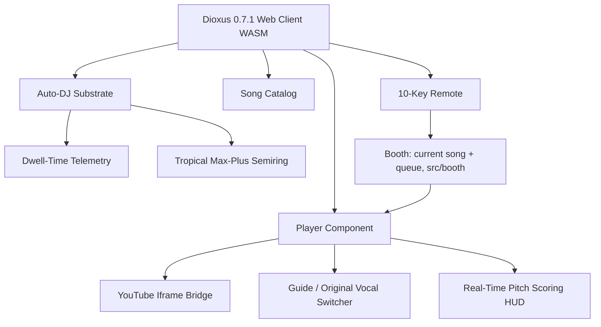

# KTV-RS System Architecture 📐

## High-Level Topology



---

## 1. Dioxus 0.7 Reactive State Coordination

In Dioxus 0.7, signals implement `Copy` and reactive dependencies are tracked automatically without legacy `Scope` or `cx` constructs:

* **`current_song`**: `Signal<Option<QueueItem>>`
* **`song_queue`**: `Signal<Vec<QueueItem>>`
* **`telemetry_history`**: `Signal<Vec<SongTelemetry>>`
* **`auto_dj_anticipations`**: `Memo<Vec<AnticipatedSong>>`

### Sleep-Time Auto-DJ Memoization
When the queue length changes or songs are finished, the app evaluates recommendation candidates in a `use_memo` hook:
```rust
let auto_dj_anticipations = use_memo(move || {
    let anticipator = SleepTimeAnticipator::new();
    let current_id = current_song().map(|item| item.song.id);
    let queue_ids = song_queue().into_iter().map(|q| q.song.id).collect();
    anticipator.anticipate_next(
        &catalog(),
        &telemetry_history(),
        current_id.as_deref(),
        &queue_ids,
        3,
    )
});
```

---

## 2. Recommendation Engine Mathematics (`katgpt-rs` inspired)

The recommendation engine models user preferences using three mathematical layers:

### A. Sigmoid Dwell-Time Gating
Tracks how long a user stays on a song:
$$\text{affinity} = \frac{1}{1 + e^{-k \cdot (\text{dwell\_ratio} - 0.5)}}$$
* Songs played past 70% of their duration boost artist and category weights by $+0.35$ and $+0.20$ respectively.

### B. Tropical $(\max, +)$ Bottleneck Pruning
Songs skipped prematurely ($\le 20$ seconds) are treated as severe negative feedback. Under the Tropical semiring $(\mathbb{R} \cup \{-\infty\}, \oplus, \otimes)$ where:
$$a \oplus b = \max(a, b)$$
$$a \otimes b = a + b$$
The zero element is $-\infty$. Early skips are masked with a $-\infty$ penalty factor, strictly disqualifying recently aborted artists from upcoming auto-plays:
$$\text{bottleneck\_penalty} = \begin{cases} -\infty & \text{if dwell} \le 20s \\ 0.0 & \text{otherwise} \end{cases}$$

---

## 3. YouTube Iframe & Audio Bridge

* **Intro Bumper Skipping**: Appends `&start={intro_skip_secs}` to the embed URL.
* **Auto-Advance Event**: The player injects a postMessage listener via `document::eval`:
  ```javascript
  window.addEventListener('message', (event) => {
      let data = typeof event.data === 'string' ? JSON.parse(event.data) : event.data;
      if (data && (data.event === 'onStateChange' && data.info === 0 || data.info === 0)) {
          dioxus.send('ended');
      }
  });
  ```
  On `"ended"`, Dioxus triggers `on_video_ended`, popping the next song from queue or falling back to the top Auto-DJ recommendation.
