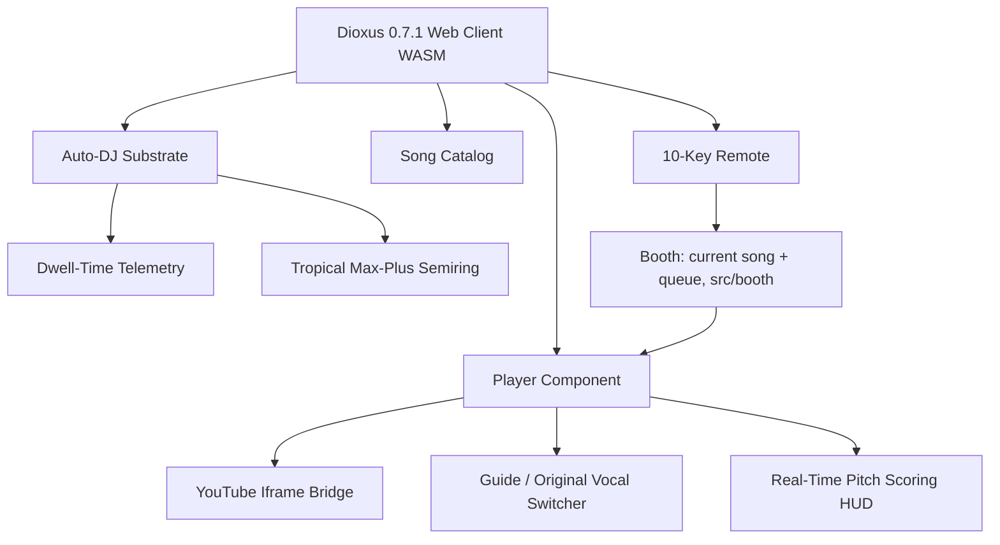

# KTV-RS System Architecture 📐

## High-Level Topology



---

## 1. Dioxus 0.7 Reactive State Coordination

In Dioxus 0.7, signals implement `Copy` and reactive dependencies are tracked automatically without legacy `Scope` or `cx` constructs:

* **`current_song`**: `Signal<Option<QueueItem>>`
* **`song_queue`**: `Signal<Vec<QueueItem>>`
* **`telemetry_history`**: `Signal<Vec<SongTelemetry>>`
* **`auto_dj_anticipations`**: `Memo<Vec<AnticipatedSong>>`

### Sleep-Time Auto-DJ Memoization
When the queue length changes or songs are finished, the app evaluates recommendation candidates in a `use_memo` hook:
```rust
let auto_dj_anticipations = use_memo(move || {
    let anticipator = SleepTimeAnticipator::new();
    let current_id = current_song().map(|item| item.song.id);
    let queue_ids = song_queue().into_iter().map(|q| q.song.id).collect();
    anticipator.anticipate_next(
        &catalog(),
        &telemetry_history(),
        current_id.as_deref(),
        &queue_ids,
        3,
    )
});
```

---

## 2. Recommendation Engine Mathematics (`katgpt-rs` inspired)

The recommendation engine models user preferences using three mathematical layers:

### A. Sigmoid Dwell-Time Gating
Tracks how long a user stays on a song:
$$\text{affinity} = \frac{1}{1 + e^{-k \cdot (\text{dwell\_ratio} - 0.5)}}$$
* Songs played past 70% of their duration boost artist and category weights by $+0.35$ and $+0.20$ respectively.

### B. Tropical $(\max, +)$ Bottleneck Pruning
Songs skipped prematurely ($\le 20$ seconds) are treated as severe negative feedback. Under the Tropical semiring $(\mathbb{R} \cup \{-\infty\}, \oplus, \otimes)$ where:
$$a \oplus b = \max(a, b)$$
$$a \otimes b = a + b$$
The zero element is $-\infty$. Early skips are masked with a $-\infty$ penalty factor, strictly disqualifying recently aborted artists from upcoming auto-plays:
$$\text{bottleneck\_penalty} = \begin{cases} -\infty & \text{if dwell} \le 20s \\ 0.0 & \text{otherwise} \end{cases}$$

---

## 3. YouTube Iframe & Audio Bridge

* **Intro Bumper Skipping**: Appends `&start={intro_skip_secs}` to the embed URL.
* **Sync core** (`assets/ktv_sync.js`): a classic script in the static `<head>` that listens to both players'
  postMessage events and keeps the guide in step. Rust wires it with `window.KtvSyncCore.install(window, send)` and
  calls `window.KtvSync.<method>(...)` through `Reflect` (`src/js_bridge.rs`); there is no `eval`, so the CSP has no
  `'unsafe-eval'`. The core reports back `TIME:<sec>`, `PAUSE_STATE:0|1`, `GUIDE_ERROR:<code>` and `ended`
  (`SyncEvent::parse`). On `ended`, `on_video_ended` pops the next song from the queue or falls back to the top Auto-DJ
  recommendation.

---

## 4. Songbook: curated catalog + full library

* **Curated catalog** (`assets/catalog.json`, `src/catalog.rs`): ~40 hand-checked songs with genres and guide
  timings, compiled into the wasm (`include_str!`), so the booth works on first paint.
* **Full library** (`assets/library.json`, `src/library/`): every official karaoke upload of each label
  (GMM Karaoke, Whattheduck, Muzik Move Karaoke; ~8,200 songs), written by `tools/harvest_library.py` from
  channel metadata (no media downloaded; every video oEmbed-checked as embeddable). It is ~900 KB raw / ~300 KB
  gzip, so it is a content-hashed asset (`asset!`, cached `immutable`) fetched after the first paint
  (`browser::fetch_text`) and set once (`library::install`, a `OnceLock`). Until it lands, only the curated songs list.
* **`Library`** is a `Copy` handle compared by identity, so props holding it never diff 8,000 songs. Its `Songbook`
  keeps a normalised search key per song (`search::search_key`), looked up in O(1) from the entry's address:
  search over the whole songbook takes ~0.2 ms per keystroke instead of ~20 ms (release build, M-series host).
* **Rendering**: `CatalogView` renders 60 cards and adds 60 per **Show more**; the count shows the full total.
* **Ids and codes**: library ids are `yt_<video id>`; codes are 5 digits in per-channel ranges (GMM 30001+,
  Whattheduck 50001+, Muzik Move 55001+), kept stable across re-harvests. `catalog::find_song` looks up the booth's
  catalog first, then the library (keypad, Remote). Queued library songs are saved in the session as full songs.
