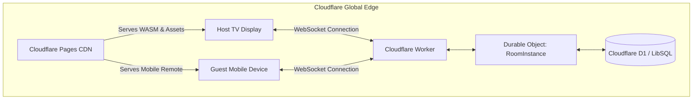

# Cloudflare Workers & Pages Deployment Guide ☁️

This guide outlines how to deploy KTV-RS as a distributed edge application using **Cloudflare Pages** for the WASM frontend and **Cloudflare Workers (`workers-rs`) + Durable Objects** for real-time multi-device room synchronization.

---

## 🏗️ Architecture Overview



* **Cloudflare Pages**: Global static hosting for compiled Dioxus WebAssembly binaries. Low latency (< 15ms in Bangkok/BKK).
* **Cloudflare Workers (`workers-rs`)**: Serverless Rust V8 isolate responding to API routes and WebSocket upgrades.
* **Durable Objects (DO)**: Strongly consistent state container per KTV room (e.g. `Room_BKK88`), keeping queue order, now-playing seek times, and live scoring in memory with zero database bottleneck.
* **Shared Types**: Both Frontend (Dioxus) and Backend (Worker) share the exact same `Song`, `QueueItem`, and `RoomEvent` structs.

---

## 1. Deploying the Frontend (Workers Static Assets) — current setup

The web app is an **assets-only Worker**: no Worker script, just the static Dioxus build served from Cloudflare's edge.

| File | Role |
|---|---|
| `wrangler.jsonc` | Worker `ktv-rs`, `assets.directory = ./dist`, SPA fallback |
| `deploy/_headers` | CSP, `Permissions-Policy: microphone=(self)`, `nosniff`, COOP, immutable caching for hashed `/assets/*` |
| `tools/build_web.sh` | Clean `dx build --release`, fails on a degraded bundle, stages `dist/` + `_headers` (also used by CI) |
| `deploy.sh` | Guards (on `main`, clean, pushed), build, `wrangler deploy --tag <git describe>`, then `wrangler deployments list` |

```bash
./deploy.sh --dry-run   # any branch: build + validate, no upload
./deploy.sh             # main only: real deploy
```

Notes:
* CSP needs `'unsafe-eval'` (Dioxus `document::eval` uses `new Function`) and `blob:` in `script-src` (mic AudioWorklet from a Blob URL).
* Local preview of the exact prod bundle + headers: `npx wrangler@4.141.0 dev` after `tools/build_web.sh`.
* "Pushed to main" is not "deployed": check `npx wrangler@4.141.0 deployments list`.
* The room server below is **not built yet**. Durable Object bindings are currently blocked by the Cloudflare versions-API `10013` / PUT `10021` issue, so the phone remote should start with WebRTC or KV polling.

---

## 2. (Planned) Room WebSocket Server with `workers-rs`

### Project Configuration (`wrangler.toml`)
```toml
name = "ktv-room-worker"
main = "build/worker/shim.mjs"
compatibility_date = "2024-09-01"

[durable_objects]
bindings = [
  { name = "ROOMS", class_name = "KtvRoomDO" }
]

[[migrations]]
tag = "v1"
new_classes = ["KtvRoomDO"]
```

### Worker Entry Point (`worker/src/lib.rs`)
```rust
use worker::*;
use serde::{Deserialize, Serialize};

#[durable_object]
pub struct KtvRoomDO {
    state: State,
    clients: Vec<WebSocket>,
    queue: Vec<String>,
}

#[durable_object]
impl DurableObject for KtvRoomDO {
    fn new(state: State, _env: Env) -> Self {
        Self {
            state,
            clients: Vec::new(),
            queue: Vec::new(),
        }
    }

    async fn fetch(&mut self, req: Request) -> Result<Response> {
        let pair = WebSocketPair::new()?;
        let server_ws = pair.server;
        server_ws.accept()?;
        
        self.clients.push(server_ws);
        
        Response::from_websocket(pair.client)
    }
}

#[event(fetch)]
pub async fn main(req: Request, env: Env, _ctx: Context) -> Result<Response> {
    let router = Router::new();
    
    router
        .get_async("/room/:room_code/ws", |_, ctx| async move {
            let room_code = ctx.param("room_code").unwrap();
            let namespace = ctx.env.durable_object("ROOMS")?;
            let id = namespace.id_from_name(room_code)?;
            let stub = id.get_stub()?;
            stub.fetch_with_request(ctx.req).await
        })
        .run(req, env)
        .await
}
```

---

## 3. Benefits of Pure Rust Cloudflare Stack

1. **Zero Serialization Drift**: Message schemas (`AddSong`, `SkipVote`, `PitchScore`) are shared across crates, completely preventing client/server protocol mismatch bugs.
2. **Sub-15ms Latency in Thailand**: Cloudflare runs PoP nodes in Bangkok, providing instant response times when guests interact with room remotes on mobile devices.
3. **Cost Efficiency**: Cloudflare Pages is 100% free with unlimited bandwidth, and Workers offer generous free-tier invocation limits for party and personal use.
