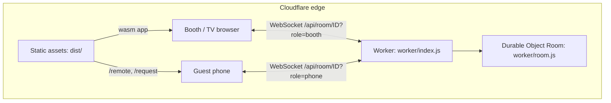

# Cloudflare Workers Deployment Guide ☁️

KTV-RS runs as one Cloudflare Worker (`ktv-rs`): static assets for the Dioxus WebAssembly app and the phone pages, plus a
small JavaScript Worker with one Durable Object per room for the phone remote. Everything else (queue, scores, settings)
lives in the booth's browser.

---

## 🏗️ Architecture Overview


```mermaid
graph TD
    subgraph Cloudflare edge
        Assets[Static assets: dist/] -->|wasm app| Booth[Booth / TV browser]
        Assets -->|/remote, /request| Phone[Guest phone]
        Booth <-->|WebSocket /api/room/ID?role=booth| Worker[Worker: worker/index.js]
        Phone <-->|WebSocket /api/room/ID?role=phone| Worker
        Worker --> DO[Durable Object Room: worker/room.js]
    end
```

* **Static assets** (`wrangler.jsonc` `assets`): served before any script runs; `run_worker_first: ["/api/*"]` sends only the API to the Worker.
* **The booth owns the state.** The Room object only relays: phone commands to the booth, the booth's state (now playing, next five) to phones. It stores that last state for a day, nothing else.

---

## 1. Deploying the Frontend (Workers Static Assets) — current setup

The web app is an **assets-only Worker**: no Worker script, just the static Dioxus build served from Cloudflare's edge.

| File | Role |
|---|---|
| `wrangler.jsonc` | Worker `ktv-rs`, `assets.directory = ./dist`, SPA fallback |
| `deploy/_headers` | CSP, `Permissions-Policy: microphone=(self)`, `nosniff`, COOP, immutable caching for hashed `/assets/*` |
| `tools/build_web.sh` | Clean `dx build --release`, fails on a degraded bundle, stages `dist/` + `_headers` (also used by CI) |
| `deploy.sh` | Guards (on `main`, clean, pushed), build, `wrangler deploy --tag <git describe>`, then `wrangler deployments list` |

```bash
./deploy.sh --dry-run   # any branch: build + validate, no upload
./deploy.sh             # main only: real deploy
```

Notes:
* CSP `script-src 'self' 'wasm-unsafe-eval' blob:`: no `'unsafe-eval'` (the app never uses `document::eval`; see `src/js_bridge.rs`), `blob:` for the mic AudioWorklet (Blob URL). A new `document::eval` would break under this CSP, and the e2e suite (which fails on CSP violations) would catch it.
* Local preview of the exact prod bundle + headers: `npx wrangler@4.141.0 dev` after `tools/build_web.sh`.
* "Pushed to main" is not "deployed": check `npx wrangler@4.141.0 deployments list`.
* The versions-API `10013` / PUT `10021` errors that once blocked Durable Object bindings were rechecked on 2026-09-28 with a throwaway DO Worker: deploy, `versions upload` and DO storage all worked, so the phone remote (section 2) ships as a DO.

---

## 2. Phone remote: Worker + Durable Object (live)

Files: `worker/index.js` (router: path, `Upgrade`, same-Origin, `role`), `worker/room.js` (the `Room` Durable Object),
`worker/protocol.js` (pure validation, tested by `tests/room_protocol.test.mjs`); booth side `src/room/` + `src/components/phone_remote.rs`;
phone page `public/remote.html` + `public/remote.js`.

* **Room id = SHA-256(booth key)**, first 22 base64url chars. The booth keeps a 32-byte random key in `localStorage` (`ktv.room.v1`)
  and proves it with a `hello` message; the Worker stores no key, and the room id in the QR cannot be turned back into it.
  Rust (`room::room_of`) and JS (`room_of`) are checked against the same vector.
* **WebSocket Hibernation API**: sockets are accepted with `ctx.acceptWebSocket`, per-socket data lives in attachments, so an idle
  room is evicted and costs nothing. SQLite-backed class (`new_sqlite_classes`), the one the Free plan allows.
* **Limits**: phone messages ≤ 256 B and a token bucket (5, then 1 per 10 s); booth messages ≤ 8 KB; 32 phones per room; at most
  4 booth sockets that have not proven the key. Skip / pause / replay are refused by the booth unless the host ticks
  *Phones may skip, pause and replay*.
* **New link** sends `close_room`: phones get close code 4004 ("scan again") and the room's storage is deleted.
* Why JavaScript, not `workers-rs`: the Worker is a ~150-line relay with no shared logic beyond the wire format; plain JS has no
  build step or wasm cold start, and the wire format is pinned by tests on both sides.
* **Rollback caveat**: Cloudflare blocks a rollback when a Durable Object class change (a `migrations` entry) lies between the
  live version and the target ([docs](https://developers.cloudflare.com/workers/configuration/versions-and-deployments/rollbacks/)).
  So the deploy workflow's automatic rollback cannot return from v0.30.0 (which adds `Room`) to v0.29.x; the pre-deploy e2e
  (same bundle and Worker under `wrangler dev`) is the guard, and a bad release is fixed by rolling forward.

---

## 3. Cost on the Free plan

Workers Free covers 100k requests/day; Durable Objects on SQLite are on the Free plan too. The booth holds one socket while the
remote is on, phones close theirs when the page is hidden, and hibernation means idle sockets do not bill duration.
